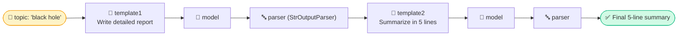
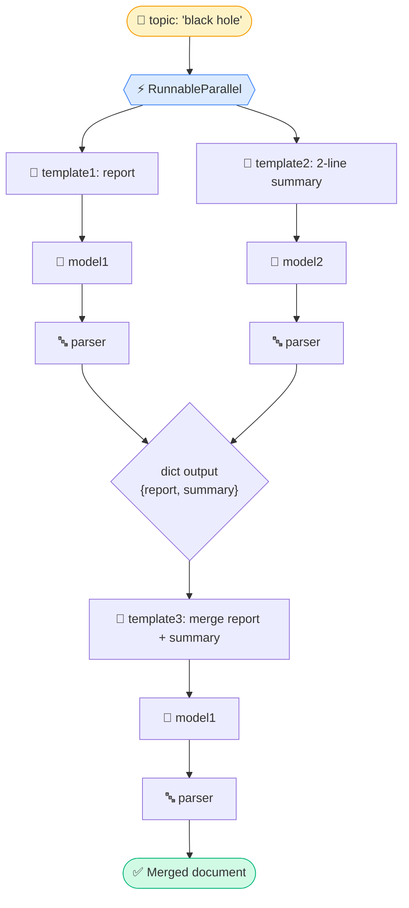
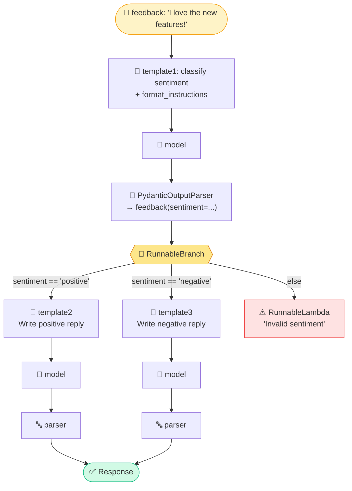
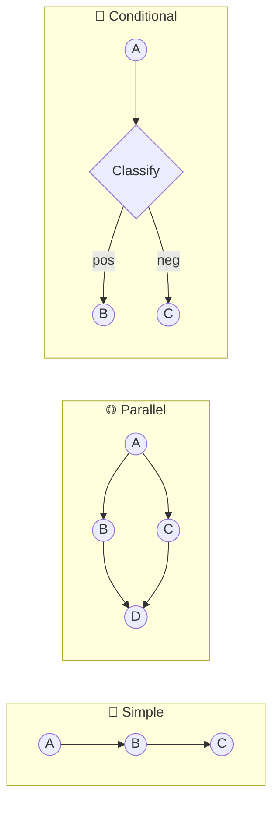

# 🦜⛓️ LangChain Chains — Today's learning
 
> **TL;DR:** Chains are just Legos. You snap `Prompt → Model → Parser` pieces together in different shapes — **straight line**, **side-by-side**, or **fork-in-the-road** — and LangChain's `|` operator (yes, the pipe!) does the plumbing for you.
 
Today I explored **3 chain patterns**: 🧵 Simple, 🌐 Parallel, 🌳 Conditional. Here's everything I learned, with diagrams so my brain doesn't melt next time I forget.
 
---
 
## 🧠 The Core Idea (LCEL in one breath)
 
Every chain is built from **Runnables** — objects that all understand `.invoke()`. Because they all speak the same language, you can glue them together with `|` like a Unix pipe:
 
```python
chain = prompt | model | parser
```
 
That's it. That's the whole trick. Everything below is just *creative arrangement* of this idea.
 
---
 
## 1️⃣ Simple Chain — "The Assembly Line" 🏭
 
**What it does:** Output of one step feeds straight into the next. No branches, no forks — just a conveyor belt.
 
In the code: it writes a **detailed report** on a topic, then feeds that whole report into a **second prompt** to summarize it in 5 lines. Two full LLM calls, chained back-to-back.
 

 
### 🔑 What I learned
| Concept | Insight |
|---|---|
| `StrOutputParser()` | Converts the model's `AIMessage` object into a plain `str`, so the *next* prompt can slot it in with `{text}` |
| Why parse in the middle? | Without it, you'd be passing a whole `AIMessage` object into a prompt template expecting a string → 💥 error |
| Chain length | You can keep piping forever: `p1 \| m \| parser \| p2 \| m \| parser \| p3 \| m \| parser...` |
| Mental model | It's literally a **relay race** — each runnable hands the baton (output) to the next |
 
> 💡 **Fun fact:** This is called "sequential chaining" — think of it like a report writer 📄 handing their draft to an editor ✂️ who condenses it.
 
---
 
## 2️⃣ Parallel Chain — "The Group Project" 🌐
 
**What it does:** Runs multiple chains **at the same time** (not one-after-another), then merges their results into one final step.
 
In the code: `RunnableParallel` fires off **two prompts simultaneously** — one writes a detailed report, the other writes a 2-line summary — using **two separate model instances**. Once both finish, a third prompt **merges** them into one document.
 

 
### 🔑 What I learned
| Concept | Insight |
|---|---|
| `RunnableParallel({...})` | Takes a **dict of runnables**; runs them concurrently; output is a **dict** with the same keys (`report`, `summary`) |
| Speed win | Instead of report-time + summary-time, you pay roughly **max(report-time, summary-time)** — they overlap ⏱️ |
| Feeding into template3 | `RunnableParallel`'s output dict `{"report": ..., "summary": ...}` maps *directly* onto `template3`'s `input_variables=['report','summary']` — no manual wiring needed! |
| Why `model1` and `model2`? | Just two client instances (could even be different models) — LangChain doesn't force you to reuse one object |
| Mental model | It's a **group project**: two teammates work independently, then a third person stitches the pieces into a final report |
 
> 💡 **Fun fact:** You could throw in a *third* parallel branch (e.g. "extract key stats") and `RunnableParallel` would fan out to 3 branches with zero extra plumbing.
 
---
 
## 3️⃣ Conditional Chain — "The Choose-Your-Own-Adventure" 🌳
 
**What it does:** Classifies the input first, then **routes** to a different sub-chain depending on the result. This is the closest thing to an `if/elif/else` in LangChain.
 
In the code: a **classifier chain** reads feedback text and outputs structured sentiment (`positive` / `negative`) using `PydanticOutputParser`. Then `RunnableBranch` checks that sentiment and routes to the matching response-writer prompt.
 

 
### 🔑 What I learned
| Concept | Insight |
|---|---|
| `PydanticOutputParser` | Forces the LLM to return **structured, validated data** (a `feedback` object with `.sentiment`), not free text — huge for reliability |
| `parser.get_format_instructions()` | Auto-generates the "please respond in this JSON schema" text injected into the prompt via `partial_variables` |
| `RunnableBranch((cond, chain), (cond, chain), default)` | Evaluates conditions **top to bottom**, runs the first chain whose lambda returns `True`; falls back to the last item (default) if none match |
| `Literal["positive","negative"]` | Pydantic + `Literal` constrains the model's output to *exactly* these two values — no "neutral" surprises |
| `RunnableLambda` | Wraps a plain Python function/lambda so it behaves like a Runnable — used here as the fallback branch |
| Mental model | It's a **bouncer at a club** 🚪 checking your "sentiment ID" and sending you to the right room |
 
> ⚠️ **Gotcha I noticed:** the branch conditions check `x.sentiment` (attribute access) because `classifier_chain` outputs a **Pydantic object**, not a dict — mixing this up is a classic bug (`x["sentiment"]` would fail here).
 
---
 
## 🎯 Side-by-Side Cheat Sheet
 
| Pattern | Shape | Runs how | Key tool | Real-world analogy |
|---|---|---|---|---|
| **Simple** | `A → B → C` | Sequential | plain `\|` | Assembly line 🏭 |
| **Parallel** | `A ⇉ (B, C) ⇉ D` | Concurrent branches, then merge | `RunnableParallel` | Group project 👥 |
| **Conditional** | `A → classify → route(B \| C \| D)` | Sequential classify, then ONE branch | `RunnableBranch` + `RunnableLambda` | Choose-your-own-adventure 🌳 |
 

 
---
 
## 📝 My Big Takeaways Today
 
1. **Everything is a Runnable** — prompts, models, parsers, even branches and lambdas. That's why `|` works everywhere.
2. **Parsers are the glue between steps** — mismatched types (object vs string vs dict) are the #1 source of chain bugs.
3. **Parallel ≠ faster prompts, it's faster *chains*** — the individual LLM calls aren't quicker, but they overlap in time.
4. **`RunnableBranch` = if/elif/else for chains**, and it needs a structured, predictable output (hence `PydanticOutputParser`) to make routing decisions reliably.
5. Naming reminder to self: it's `parallel_chains`, not `parralel_chains` 😅 (typo spotted in my own code, will fix tomorrow).
---
 
*🗓️ Logged as part of my "today's mix" learning notes — next up: exploring `RunnableMap`, `.batch()`, and streaming with `.stream()`!*