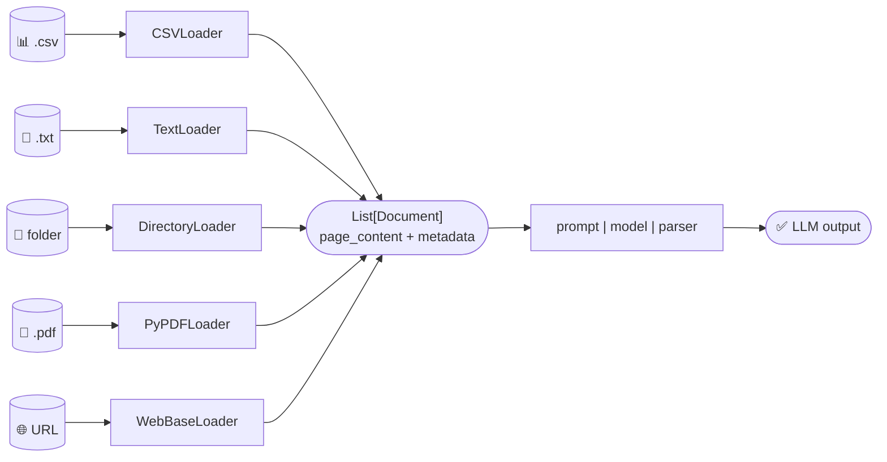

# 📂 Document Loaders — Loading Screen
 
Today's theme: **how do I even get data INTO a chain in the first place?** Turns out every LangChain project starts the same way — some file/URL sitting outside the code, and a **Loader** whose only job is to turn it into a list of `Document` objects (each one has `.page_content` and `.metadata`).
 
Instead of my usual "concept → code → table" format, I'm doing this one as **loader trading cards** 🃏 — because honestly that's how it felt going through 5 different loaders back to back, each with its own personality.
 
---
 
## 🎴 Card #1 — CSVLoader
 
> *"I turn spreadsheets into a stack of index cards, one per row."*
 
```python
loader = CSVLoader(file_path='document.csv')
docs = loader.load()
print(len(docs))
print(docs[0])
```
 
**Special move:** Every single **row** in the CSV becomes its own `Document`. So `len(docs)` isn't "1 document," it's "however many rows you have."
 
**Loot dropped:** `docs[0]` shows the first row's data crammed into `page_content` as `column: value` pairs, plus metadata like the source file and row number.
 
**Boss fight I nearly lost to:** I assumed `docs[0]` would be the *whole file*. Nope — it's row zero. If your CSV has 500 rows, you get 500 tiny documents, not one big one.
 
---
 
## 🎴 Card #2 — DirectoryLoader (+ TextLoader combo)
 
> *"I don't load files. I load an entire folder of files, one loader at a time."*
 
```python
loader = DirectoryLoader(
    path='Text_files',
    glob="*.txt",
    loader_cls=TextLoader,
    loader_kwargs={'encoding': 'utf-8'}
)
docs = loader.load()
```
 
**Special move:** `DirectoryLoader` is basically a *manager* — it doesn't know how to read `.txt` files itself, it hires `TextLoader` (via `loader_cls`) to do that for every file matching `glob="*.txt"` inside the folder.
 
**Loot dropped:** One `Document` per file in the folder, each with its own `metadata` (I checked `docs[1].metadata` — it hands back the file path, which is genuinely useful for tracking *which* file a chunk came from later).
 
**Note-to-self scribbled in the code:** `## use lazy loading to load the documents one by one and fastly` — `.load()` reads everything into memory at once, but there's a `.lazy_load()` version that yields documents one at a time instead of loading the whole folder upfront. Worth switching to once the folder gets big — no point holding 500 files in RAM if you're only processing them one by one anyway.
 
**Also noticed:** the actual chain part (`prompt1 | model | parser`) is commented out in this file — looks like today was purely "let's get the loading part working first," LLM step for later. Fair strategy.
 
---
 
## 🎴 Card #3 — PyPDFLoader
 
> *"I don't load a PDF. I load a PDF, one page at a time."*
 
```python
loader = PyPDFLoader('document.pdf')
docs = loader.load()
print(docs[0])
print(docs[1].metadata)
```
 
**Special move:** Same pattern as CSV, different unit — instead of one-document-per-row, it's **one document per page**. `docs[0]` = page 1, `docs[1]` = page 2, and so on.
 
**Loot dropped:** `docs[1].metadata` includes things like the page number and source path — handy if you ever need to cite "this came from page 3."
 
**This is the one that actually got used:** unlike the folder-loader file, here the pipeline goes all the way through:
```python
chain = prompt1 | model | parser
result = chain.invoke({'topic': docs[0].page_content})
```
So page 1's text becomes the `{topic}` for a one-line poem prompt. Neat little proof that a loaded document slots straight into a chain like any other string input, no extra conversion needed.
 
---
 
## 🎴 Card #4 — TextLoader (the simple one)
 
> *"One file. One document. No drama."*
 
```python
loader = TextLoader('document.txt', encoding='utf-8')
docs = loader.load()
```
 
**Special move:** The most basic loader in the lineup — a single `.txt` file becomes a single `Document` (so `docs` is a list of length 1). This is what `DirectoryLoader` was calling behind the scenes in Card #2, just now I'm using it solo.
 
**Loot dropped:** `docs[0].metadata` — mainly just the source filename, nothing fancy since there's only one file involved.
 
**Why `encoding='utf-8'` matters:** left it out once by accident on a different file and got a `UnicodeDecodeError` — some `.txt` files aren't plain ASCII, so specifying the encoding up front saves a debugging headache later.
 
---
 
## 🎴 Card #5 — WebBaseLoader
 
> *"Give me a URL. I'll scrape the page and hand you back its text."*
 
```python
url = "https://www.flipkart.com/apple-macbook-pro-..."
loader = WebBaseLoader(url)
docs = loader.load()
print(len(docs))
print(docs[0].page_content)
```
 
**Special move:** Fetches a live webpage and pulls out its visible text into `page_content` — basically turns "a product page on the internet" into something a chain can read, no manual copy-pasting required.
 
**Loot dropped:** For a single URL, `len(docs)` comes back as 1 — the whole page is one `Document` (unlike PDF/CSV which split per page/row).
 
**Reality check:** scraped e-commerce pages tend to be noisy — nav bars, "customers also bought," footer links, all mixed in with the actual product description. Loading the page is step one; cleaning/trimming that content before feeding it to a prompt is probably step two on a real project.
 
---
 
## 🗂️ The Full Deck, At a Glance
 
| Loader | Input | 1 Document = | Best for |
|---|---|---|---|
| `CSVLoader` | `.csv` file | 1 row | Tabular data, structured records |
| `DirectoryLoader` | a folder | delegates to another loader per file | Bulk-loading many files at once |
| `PyPDFLoader` | `.pdf` file | 1 page | PDFs, reports, papers |
| `TextLoader` | `.txt` file | the whole file | Single plain-text files |
| `WebBaseLoader` | a URL | the whole page | Scraping live web content |
 
---
 
## 🧵 The One Thread Connecting All Five
 
No matter which loader I used, I always ended up with the exact same shape: **a list of `Document` objects**, each with `.page_content` (the actual text) and `.metadata` (info *about* that text — source, page number, row number, etc). That consistency is clearly the whole point — once your data is loaded, it doesn't matter if it came from a CSV, a PDF, or a scraped webpage, it can plug into the exact same `prompt | model | parser` chain downstream.
 

 
---
 
## 🧠 Things I want to remember next week
 
- `.load()` grabs everything at once; `.lazy_load()` exists for when the source is too big to pull into memory in one go.
- "1 document" means something different for every loader — row, page, file, or whole-page — always check before assuming.
- `DirectoryLoader` isn't a loader on its own, it's a wrapper that fans out to whichever `loader_cls` you give it.
- `docs[i].page_content` is just a string, so it drops straight into any prompt's `{variable}` — no glue code needed between "loaded data" and "chain input."
- Web-scraped content is messy by default — probably need a cleanup/splitting step before it's actually prompt-ready.
---
 
*🗓️ Logged as part of my "today's" learning notes.*