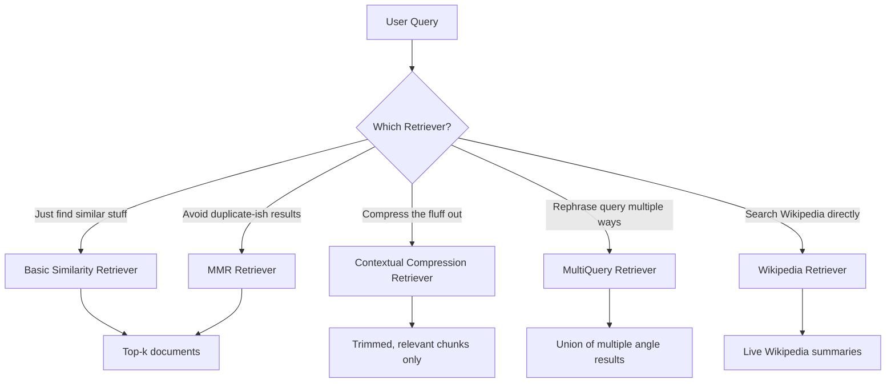

# 🎣 Retrievers — Fishing the Right Info Out of a Sea of Documents
 
## 🧠 Concept
 
Okay so here's the thing about retrievers — a **retriever** is basically the "search engine" part of a RAG pipeline. You dump a bunch of documents into a vector store, and the retriever's job is to go fetch the *most relevant* ones when a query comes in.
 
But not all retrievers fetch the same way. Today I explored **5 different flavors**, and honestly each one has a very different personality:
 

 
A few key terms that kept popping up (explained the human way, not textbook way):
 
- **Embeddings** → turning text into a list of numbers so a computer can measure "how similar" two pieces of text are. Think of it as GPS coordinates for meaning.
- **Vector Store (ChromaDB)** → a database that stores those number-lists and lets you search "what's closest to this point" super fast.
- **`k`** → how many results you want back. `k=2` means "give me your top 2 picks."
- **`search_kwargs`** → the settings dictionary you hand to the retriever, like telling it "here's how you should search."
- **`persist_directory`** → where ChromaDB saves its data to disk so you don't have to re-embed everything every single run. Big time-saver.
## 🛠️ What I Built
 
I built out 5 mini-experiments, each testing a different retriever strategy on the same kind of playground (cricket, football, Python, ChromaDB docs — my go-to test documents at this point 😅):
 
| # | Retriever Type | What Makes It Special |
|---|----------------|------------------------|
| 1 | **Contextual Compression Retriever** | Fetches docs, then uses an LLM to *squeeze out* only the relevant sentences — no more, no less. |
| 2 | **MMR Retriever** (`search_type="mmr"`) | Fetches a wider pool (`fetch_k`) and then picks a *diverse* subset instead of just the top-k most similar ones (avoids repetitive results). |
| 3 | **MultiQuery Retriever** | Uses an LLM to rewrite your one query into multiple versions, searches with all of them, and merges the results — great when your query is vague or one-sided. |
| 4 | **Basic Similarity Retriever** | The OG. No fancy logic — just "find the k closest embeddings" using HuggingFace's `all-MiniLM-L6-v2`. |
| 5 | **Wikipedia Retriever** | Doesn't even need a vector store — it queries live Wikipedia and hands you back real article content. |
 
## 💡 Key Learnings
 
- **Contextual Compression** is basically a retriever + an LLM working together. The `LLMChainExtractor` reads each retrieved doc and trims it down to just the parts that actually answer the query. Great for cutting down noise before it hits your final LLM call and eats up tokens.
- **MMR (Maximal Marginal Relevance)** solves a real problem: plain similarity search can return 3 documents that basically say the same thing. MMR balances *relevance* AND *diversity* — `fetch_k` is the bigger pool it picks from, `k` is what it finally hands you.
- **MultiQueryRetriever** is clutch when a single query might be phrased in a way that misses relevant docs. It's like asking the same question to 3 different friends in 3 different ways, then combining all their answers.
- Not every retriever needs a vector store! `WikipediaRetriever` is a great reminder that "retriever" is a broader interface — LangChain has retrievers for APIs, search engines, arXiv, and more, not just your local embeddings.
- Small gotcha I noticed in my own code: I used `"gemini-3.5-flash"` in a couple of snippets — worth double-checking that model name is actually valid before running, since `gemini-2.5-flash` is what I've been using elsewhere.
- `ContextualCompressionRetriever` and `MultiQueryRetriever` both live in `langchain_classic.retrievers` now — good to note since import paths keep shifting as LangChain reorganizes itself.
## 💻 Code Snippet
 
Here's the core pattern for the **MMR retriever** (my favorite of the bunch today — simple but genuinely useful):
 
```python
retriever = vector_store.as_retriever(
    search_type="mmr",
    search_kwargs={
        "k": 2,        # final number of docs returned
        "fetch_k": 3   # pool size to pick diverse docs from
    }
)
 
results = retriever.invoke("Tell me about vector databases")
 
for doc in results:
    print(doc.page_content)
```
 
And the **Contextual Compression** pattern, which pairs a base retriever with an LLM-powered compressor:
 
```python
compressor = LLMChainExtractor.from_llm(llm)
 
compression_retriever = ContextualCompressionRetriever(
    base_compressor=compressor,
    base_retriever=base_retriever,
)
 
results = compression_retriever.invoke("What is ChromaDB used for?")
```