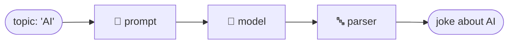
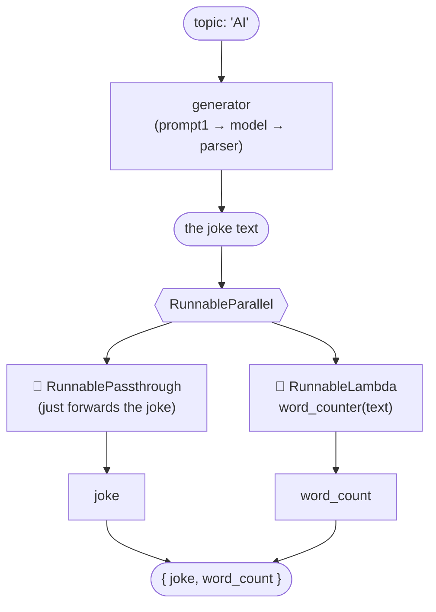
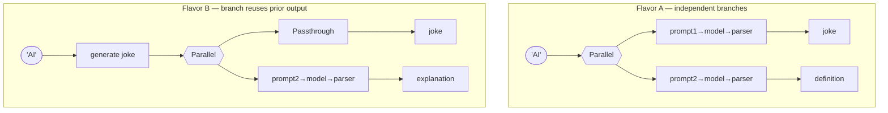
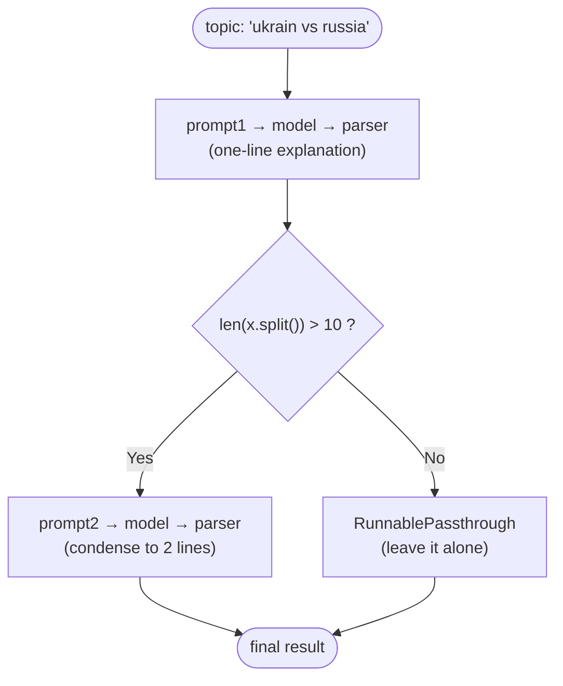
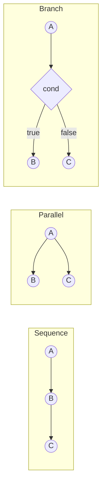

# 🏃 LangChain Runnables 
 
Okay so today's rabbit hole was **Runnables** — basically the actual "thing" behind every `|` I've been typing without thinking about it. Turns out `prompt | model | parser` isn't magic syntax, it's just three Runnable objects politely passing data to each other. Once that clicked, everything else in LangChain started making a lot more sense.
 
I played with **5 versions of the same joke-about-AI chain**, each one bolting on a new Runnable type. Writing it down here before I forget it again.
 
---
 
## 🧩 First, what even is a Runnable?
 
Anything with a `.invoke()` method. That's the whole club membership requirement. A prompt is a Runnable, a model is a Runnable, a parser is a Runnable — and so are the special "connector" ones I learned today: `RunnableSequence`, `RunnableParallel`, `RunnablePassthrough`, `RunnableLambda`, `RunnableBranch`.
 
The `|` operator I've been using this whole time? That's just shorthand for `RunnableSequence`. Wild.
 
---
 
## 1️⃣ RunnableSequence — the one I already knew, just spelled out
 
```python
chain = RunnableSequence(prompt, model, parser)
```
 
is literally identical to
 
```python
chain = prompt | model | parser
```
 
No difference in behavior, `RunnableSequence` is just the explicit, spelled-out version of the pipe. Good to know it exists in case I ever need to build a chain dynamically (like from a list of steps) instead of typing pipes by hand.
 

 
---
 
## 2️⃣ RunnablePassthrough — "just hand it forward, don't touch it"
 
This one confused me for a solid five minutes. It doesn't *do* anything to the data — it just passes whatever comes in straight out again, unchanged. So why would you ever need that?
 
Answer: when you're inside a `RunnableParallel` and one branch needs the **original input untouched**, while another branch transforms it.
 
```python
generator = RunnableSequence(prompt1, model, parser)   # makes the joke
 
parallel_chain = RunnableParallel({
    'joke': RunnablePassthrough(),        # just keep the joke as-is
    'word_count': RunnableLambda(word_counter)   # but also count its words
})
 
final_chain = RunnableSequence(generator, parallel_chain)
```
 
So the joke gets generated once, then it's handed to *two* branches at the same time — one branch does nothing (Passthrough), the other counts the words. Both branches get the same joke as input, they just treat it differently.
 

 
**The lightbulb moment:** Passthrough exists purely so you can keep the *original* value around while also computing *derived* values from it, all in the same parallel step. Without it, generating the word count would mean throwing away the actual joke.
 
---
 
## 3️⃣ RunnableLambda — "let me just run a normal Python function here"
 
This is the escape hatch for whenever a step isn't a prompt or a model, it's just... regular code.
 
```python
def word_counter(text):
    return len(text.split())
 
RunnableLambda(word_counter)
```
 
Wrapping a plain function in `RunnableLambda` gives it a `.invoke()` method so it can sit inside a chain like any other Runnable. Basically it's LangChain's way of saying "you don't have to make everything an LLM call, sometimes you just need `len(text.split())`."
 
---
 
## 4️⃣ RunnableParallel — running branches side by side
 
Saw this one twice today in slightly different flavors, and it clicked that the pattern is always the same: **give it a dict, get a dict back**, where each key ran independently (and roughly at the same time, not one after another).
 
**Flavor A — two totally separate chains, same input:**
 
```python
parallel_chain = RunnableParallel({
    'joke': RunnableSequence(prompt1, model, parser),
    'definition': RunnableSequence(prompt2, model, parser)
})
```
 
Topic "AI" goes in, and you get `{'joke': "...", 'definition': "..."}` out — the joke chain and the definition chain don't know about each other at all.
 
**Flavor B — one branch reuses the output of another (the "explain the joke" version):**
 
```python
generator = RunnableSequence(prompt1, model, parser)   # generates the joke
 
parallel_chain = RunnableParallel({
    'joke': RunnablePassthrough(),
    'explanation': RunnableSequence(prompt2, model, parser)
})
 
final_chain = RunnableSequence(generator, parallel_chain)
```
 
Here the joke is generated *first*, and then both branches inside the parallel step work off that same joke — one just keeps it (Passthrough), the other explains it (a second LLM call).
 

 
**Takeaway:** `RunnableParallel` doesn't care *what* each branch does internally — it can be a full sub-chain, a passthrough, or a lambda. It just fires all of them with the same input and collects the results into one dict.
 
---
 
## 5️⃣ RunnableBranch — finally, an actual if/else
 
Saved the best for last. This is the one that behaves like real conditional logic.
 
```python
generator = RunnableSequence(prompt1, model, parser)   # one-line explanation
 
parallel_chain = RunnableBranch(
    (lambda x: len(x.split()) > 10, RunnableSequence(prompt2, model, parser)),
    RunnablePassthrough()
)
 
final_chain = RunnableSequence(generator, parallel_chain)
result = final_chain.invoke({'topic': 'ukrain vs russia'})
```
 
Reading this out loud: "generate a one-line explanation, and *if that explanation is longer than 10 words*, summarize it further in two lines — otherwise just leave it as it is."
 
`RunnableBranch` takes `(condition, chain)` pairs, checks them top to bottom, and runs the first chain whose condition is `True`. The last argument (no condition attached) is the default/fallback — here it's a `RunnablePassthrough`, meaning "if the explanation was already short, don't bother summarizing it further."
 

 
Compared to yesterday's `RunnableBranch` with sentiment classification, this one's condition isn't based on a separate classifier step — it's just checking a plain property of the text itself (word count). Nice reminder that the condition function can be *anything* that returns True/False, it doesn't need its own LLM call.
 
---
 
## 🗺️ All Five, Side by Side
 
| Runnable | What it's for | Real-world feel |
|---|---|---|
| `RunnableSequence` | Chain steps one after another | The `\|` operator, spelled out |
| `RunnablePassthrough` | Forward input unchanged | "No thanks, I'm good as I am" |
| `RunnableLambda` | Drop in plain Python logic | An escape hatch from LLM-land |
| `RunnableParallel` | Run multiple branches on the same input, collect a dict | Split the work, merge the results |
| `RunnableBranch` | Pick ONE path based on a condition | An actual if/elif/else |
 

 
---
 
## 💭 What actually stuck with me today
 
- `RunnableSequence` and `|` are literally the same thing, one's just more explicit.
- `RunnablePassthrough` only makes sense once you're inside a `RunnableParallel` — on its own it looks pointless, but it's how you preserve original data while computing something derived from it in the same breath.
- `RunnableLambda` means I'm never stuck writing everything as an LLM call — plain functions can be first-class citizens in a chain.
- `RunnableParallel` always returns a dict shaped exactly like the dict you gave it, which makes it dead simple to feed into the next step.
- `RunnableBranch` is genuinely the closest thing to real control flow, and the condition can check anything — word count, sentiment, whatever — it doesn't have to come from another LLM call.
Next up on my list: `.batch()` vs `.stream()`, and maybe finally understanding what `RunnableConfig` actually configures.
 
---
 
*🗓️ Logged as part of my "today's" learning notes.*