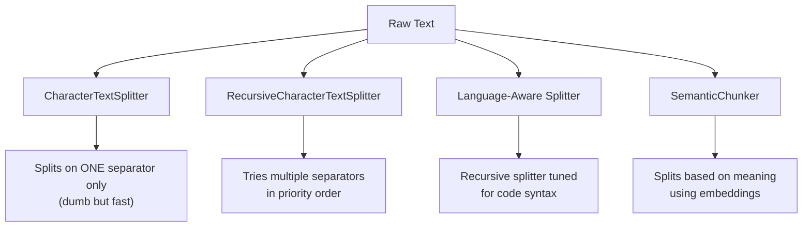

# ✂️ Text Splitters — Chopping Text the Smart Way
 
Every RAG pipeline eventually asks the same boring-but-critical question: *"how do I break this giant text into chunks that actually make sense?"* Today's session was all about answering that — from the dumbest possible splitter to one that actually understands meaning.
 

 
---
 
## 🪓 1. CharacterTextSplitter
 
### Concept
The simplest splitter in LangChain's toolbox. You give it **one separator** (like `"."`), a `chunk_size`, and a `chunk_overlap` — and it just slices the text wherever that separator shows up, packing characters up to the size limit.
 
### What I built
- Split a plain string directly with `split_text()`
- Then leveled up: loaded a `.txt` file with `TextLoader` and split the resulting `Document` objects using `split_documents()` — this keeps metadata (like source file) attached to each chunk instead of just returning raw strings.
### Key Learnings
- `split_text()` → works on raw strings, returns a list of strings
- `split_documents()` → works on `Document` objects, returns a list of `Document` objects (metadata intact 🎯)
- If your `separator` doesn't appear often enough, chunks can end up bigger than `chunk_size` — it prioritizes not breaking the separator rule over strictly obeying the size limit
- `chunk_overlap` helps preserve context between consecutive chunks so you don't lose meaning at the boundary
### Code Snippet
```python
from langchain_text_splitters import CharacterTextSplitter
from langchain_community.document_loaders import TextLoader
 
loader = TextLoader('document.txt', encoding='utf-8')
docs = loader.load()
 
splitter = CharacterTextSplitter(chunk_size=50, chunk_overlap=10, separator=".")
splits = splitter.split_documents(docs)
print(splits[0].page_content)
```
 
---
 
## 🌳 2. RecursiveCharacterTextSplitter
 
### Concept
The upgrade nobody warned me I needed. Instead of relying on a single separator, it tries a **list of separators in order of priority** (`["\n\n", "\n", " ", ""]` by default) — recursively splitting until chunks fit within `chunk_size`. This is why it's the go-to default for most RAG pipelines.
 
### What I built
Split the same demo text using `RecursiveCharacterTextSplitter` with the same `chunk_size=50, chunk_overlap=10` and compared the chunk count/quality against the plain `CharacterTextSplitter`.
 
### Key Learnings
- Way better at respecting `chunk_size` limits than `CharacterTextSplitter` since it has fallback separators
- Tries to keep paragraphs → sentences → words together as long as possible, only breaking at the character level as a last resort
- Almost always the safer default choice unless you have a very specific single-separator use case
### Code Snippet
```python
from langchain_text_splitters import RecursiveCharacterTextSplitter
 
splitter = RecursiveCharacterTextSplitter(chunk_size=50, chunk_overlap=10)
splits = splitter.split_text(text)
print(splits)
print(len(splits))
```
 
---
 
## 🐍 3. Language-Aware Splitting (`Language.PYTHON`)
 
### Concept
Splitting code with a generic text splitter is a recipe for chopping a function in half mid-`def`. `RecursiveCharacterTextSplitter.from_language()` uses **syntax-aware separators** specific to a programming language, so it tries to break at logical boundaries like class/function definitions instead of random characters.
 
### What I built
Took a small `Car` class in Python and split it using `Language.PYTHON` — watched how it respected class and method boundaries instead of butchering the code mid-line.
 
### Key Learnings
- LangChain supports a bunch of languages out of the box (Python, JS, Markdown, HTML, etc.) via the `Language` enum
- Under the hood it's still a `RecursiveCharacterTextSplitter` — just preloaded with language-specific separator hierarchies (e.g. `\nclass `, `\ndef `, `\n\tdef `, etc. for Python)
- Genuinely useful for building code-aware RAG systems (like a chatbot that answers questions over a codebase)
### Code Snippet
```python
from langchain_text_splitters import RecursiveCharacterTextSplitter, Language
 
splitter = RecursiveCharacterTextSplitter.from_language(
    Language.PYTHON,
    chunk_size=50,
    chunk_overlap=10
)
 
splits = splitter.split_text(text)
print(splits)
print(len(splits[0]))
```
 
---
 
## 🧠 4. SemanticChunker
 
### Concept
This one's a different beast entirely — instead of splitting on characters or syntax, it splits based on **meaning**. It uses embeddings to measure how semantically similar consecutive sentences are, and creates a new chunk whenever there's a big enough "meaning jump" (a breakpoint).
 
### What I built
Ran `SemanticChunker` over a text that intentionally has two very different topics glued together (splitter mechanics + a paragraph about terrorism) to see if it would correctly detect the topic shift and split there.
 
### Key Learnings
- Needs an embeddings model (`OpenAIEmbeddings` here) since it reasons about meaning, not just characters
- `breakpoint_threshold_type` controls *how* it decides where the "jump" is significant enough to split — `"standard_deviation"` is one strategy among a few (percentile, interquartile, gradient)
- `breakpoint_threshold_amount` tunes sensitivity — lower values = more aggressive splitting
- This is the most "expensive" splitter of the four (needs embedding calls) but gives the most contextually coherent chunks — great for RAG when chunk quality matters more than speed
### Code Snippet
```python
from langchain_experimental.text_splitter import SemanticChunker
from langchain_openai.embeddings import OpenAIEmbeddings
 
embeddings = OpenAIEmbeddings()
 
text_splitter = SemanticChunker(
    embeddings,
    breakpoint_threshold_type="standard_deviation",
    breakpoint_threshold_amount=1.0
)
 
splits = text_splitter.split_text(text)
print(splits)
```
 
---
 
## 📊 Splitter Showdown
 
| Splitter | Splits by | Needs Embeddings? | Best for |
|---|---|---|---|
| `CharacterTextSplitter` | Single separator | ❌ | Simple, predictable text with a clear delimiter |
| `RecursiveCharacterTextSplitter` | Multiple fallback separators | ❌ | General-purpose default for most RAG pipelines |
| `RecursiveCharacterTextSplitter.from_language()` | Language syntax rules | ❌ | Splitting source code without breaking logic |
| `SemanticChunker` | Meaning / topic shifts | ✅ | High-quality RAG where chunk coherence > speed |
 
---
 
## 🚀 Big Takeaway
Chunking isn't a solved, one-size-fits-all problem — it's a spectrum from "dumb and fast" to "smart and expensive." Character-based splitters are great starting points, language-aware splitting is a must for code, and semantic chunking is the tool to reach for when your RAG answers are suffering because chunks are cutting ideas in half.
 
---