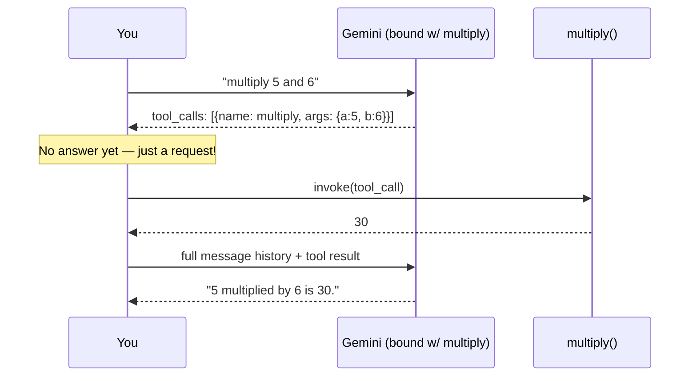

# 🔁 Tool Calling — The LLM Actually Decides to Use a Tool
 
Up till now *I* was the one invoking tools directly. Today the LLM did it — it looked at a question, decided "yep, I need `multiply` for this," and called it itself.
 
---
 
## 🎯 Concept
 
`bind_tools()` is the magic word. It doesn't make the LLM *run* your function — it just tells the model "here's what's available, and here's its shape." The model still just outputs text... except now that text can be a structured request: *"call `multiply` with a=5, b=6."*
 
Your code is still the one that actually executes it. The LLM proposes, you dispose.
 
---
 
## 🔄 The Round Trip
 

 
**Two LLM calls, one tool execution, in the middle.** That's the whole pattern.
 
<details>
<summary>🎮 Guess before you scroll: what does <code>result.content</code> look like on that <em>first</em> LLM call — the one that decides to call the tool?</summary>
Mostly **empty**. The model isn't answering yet — it's asking *you* to run something first. All the actual info lives in `result.tool_calls`, not `result.content`. This trips people up constantly.
</details>
---
 
## 🏗️ What I Built
 
A 4-step loop:
 
1. **Bind** — `llm.bind_tools([multiply])` tells Gemini this tool exists.
2. **Ask** — send `"multiply 5 and 6"`, get back a `tool_calls` request (not an answer).
3. **Execute** — run `multiply.invoke(result.tool_calls[0])` locally, append the output to the conversation.
4. **Resolve** — send the whole message history back to the LLM, *now* it gives the final answer.
---
 
## 💡 Key Learnings
 
- **`bind_tools` ≠ auto-execution.** The LLM only *requests* a call — nothing runs until your code invokes it.
- **`messages` list is the memory here.** Every step — human message, AI's tool request, tool's result — gets appended. The final `.invoke(messages)` sees the full trail, which is *how* it knows the answer is 30 without recomputing anything.
- **`tool.invoke(result.tool_calls[0])`** conveniently accepts the whole tool_call dict (name + args + id) — no manual unpacking needed.
- Two round trips to the LLM for one multiplication feels heavy, but this exact loop is the backbone of every tool-using agent you'll build from here on.
---
 
## 💻 Code Snippet
 
```python
llm_max = llm.bind_tools([multiply])
 
query = HumanMessage(content="multiply 5 and 6")
messages = [query]
 
result = llm_max.invoke(messages)      # → tool_calls, not an answer
messages.append(result)
 
tool_result = multiply.invoke(result.tool_calls[0])   # actually run it
messages.append(tool_result)
 
llm_result = llm_max.invoke(messages)  # → now it answers for real
print(llm_result.content[0]["text"])
```
 
Next logical step: stop doing this loop by hand and let an **agent** manage it 🤖
