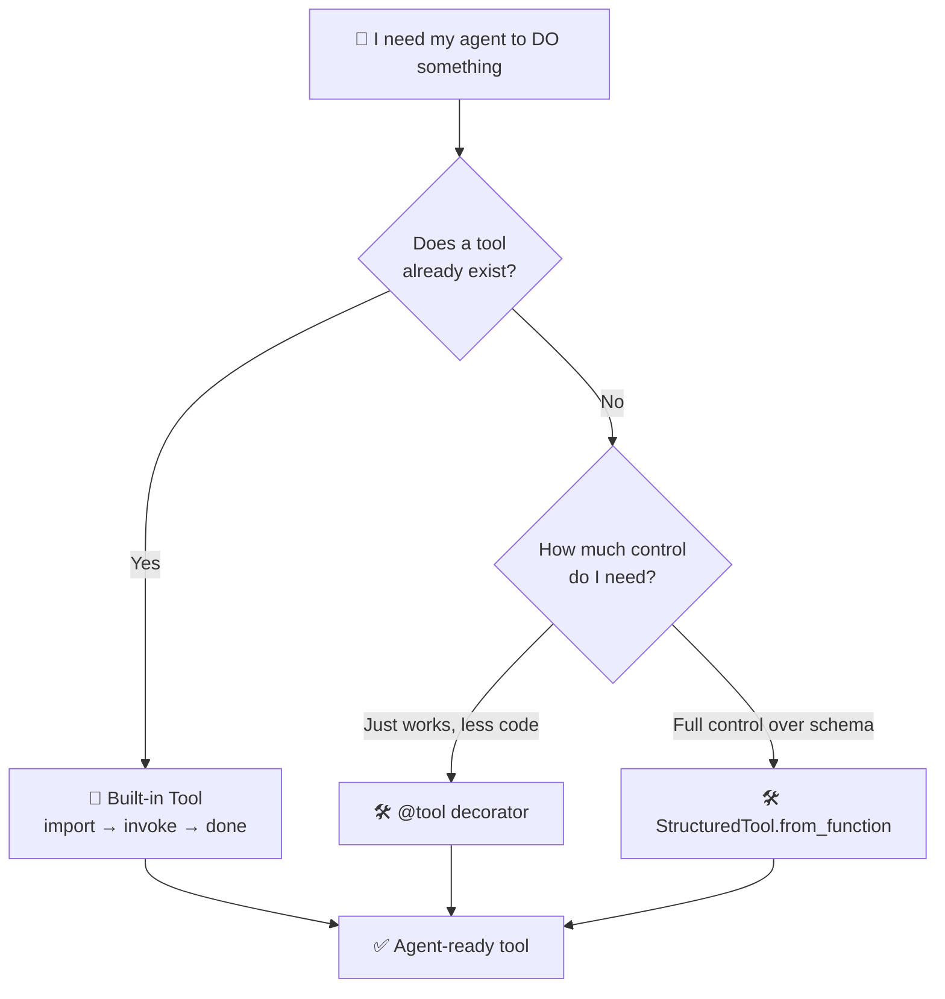

# 🧰 LangChain Tools
 
Taught my LLM to stop just *talking* and actually *do things* — search the web, run shell commands, and multiply numbers without hallucinating the answer.
 
---
 
## 🎯 The Big Idea
 
An LLM alone = a brain in a jar. No hands, no internet, no terminal.
**Tools** = hands. Wrap a function or service, and the model can act — then the result feeds back in.
 

 
Today I walked all three branches. Let's dive in.
 
---
 
## 🏪 Segment 1: Built-in Tools
 
These already exist — someone else did the work. You just import and invoke.
 
**`DuckDuckGoSearchRun`** — free web search, no API key needed.
```python
from langchain_community.tools import DuckDuckGoSearchRun
 
search_tool = DuckDuckGoSearchRun()
result = search_tool.invoke("todays headlines news")
print(result)
```
 
**`ShellTool`** — runs actual terminal commands from Python.
```python
from langchain_community.tools import ShellTool
 
shell = ShellTool()
result = shell.invoke("ls")
print(result)
```
 
<details>
<summary>🎮 Quick gut-check: which of these two is riskier to hand an autonomous agent?</summary>
**ShellTool, easily.** Search just returns text. Shell access is basically a terminal with no sense of consequences — an agent could run `rm -rf` just as easily as `ls`. Great for demos, needs serious sandboxing in anything real.
</details>
---
 
## 🛠️ Segment 2: Custom Tools
 
No built-in exists? Build your own. Two philosophies, same job — multiplying two numbers.
 
**Path A — `StructuredTool.from_function()`**
Explicit and verbose. You hand-write the schema.
```python
from langchain_core.tools import StructuredTool
from pydantic import BaseModel, Field
 
class Multiply(BaseModel):
    a: int = Field(required=True, description="first number")
    b: int = Field(required=True, description="second number")
 
def multiply(a: int, b: int):
    """multiply two numbers"""
    return a * b
 
multiply_tool = StructuredTool.from_function(
    func=multiply,
    name="multiply",
    description="multiply two numbers",
    args_schema=Multiply
)
 
print(multiply_tool.invoke({"a": 5, "b": 10}))
```
 
**Path B — `@tool` decorator**
Same job, a fraction of the code. Schema auto-inferred from type hints.
```python
from langchain_core.tools import tool
 
@tool
def multiply(a: int, b: int):
    """multiply two numbers"""
    return a * b
 
print(multiply.invoke({"a": 5, "b": 10}))
print(multiply.name, multiply.description, multiply.args)
```
 
<details>
<summary>🏆 Which path wins — brevity or control?</summary>
**`@tool` wins on brevity** — one decorator, done. **`StructuredTool` wins on control** — separate reusable schema, custom per-field descriptions, easier validation. Pick based on whether you need that extra control or just want it working fast.
</details>
---
 
## 💡 Key Takeaways
 
- A tool is **function + metadata** — the LLM reads `name`, `description`, and `args`, never your actual code. Docstrings aren't decoration, they're the pitch.
- Built-in tools trade control for speed. Custom tools trade speed for control.
- `ShellTool` is a reminder: giving an agent "hands" also means giving it the ability to mess things up. Guardrails matter the moment tools touch anything real.
Next up: an agent that actually **picks** which of these tools to use on its own. 🤖